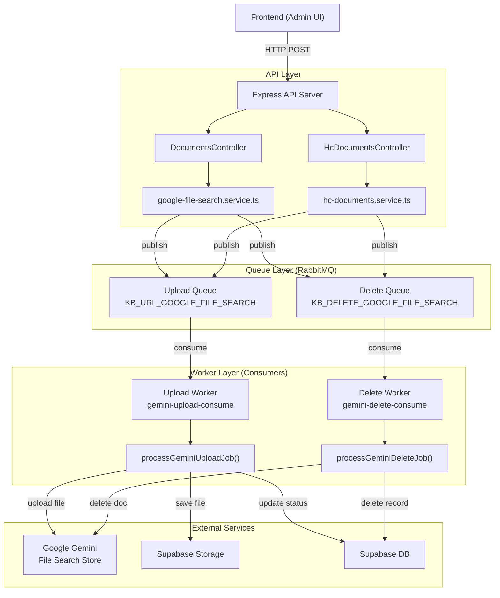
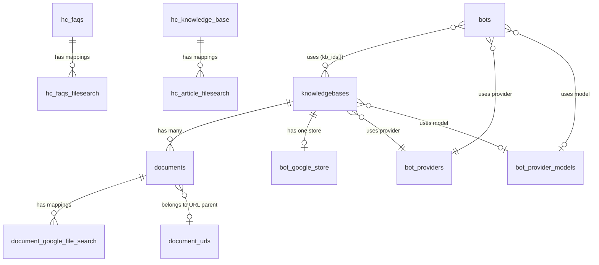
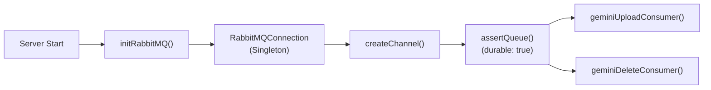
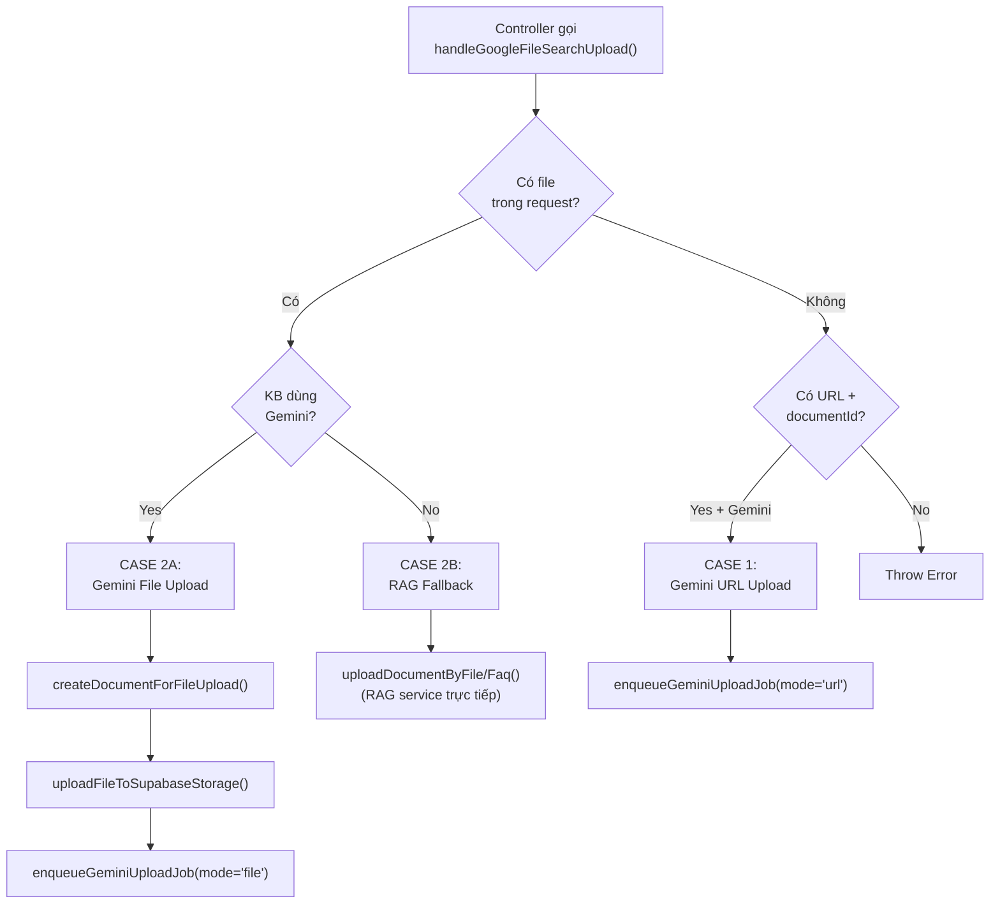
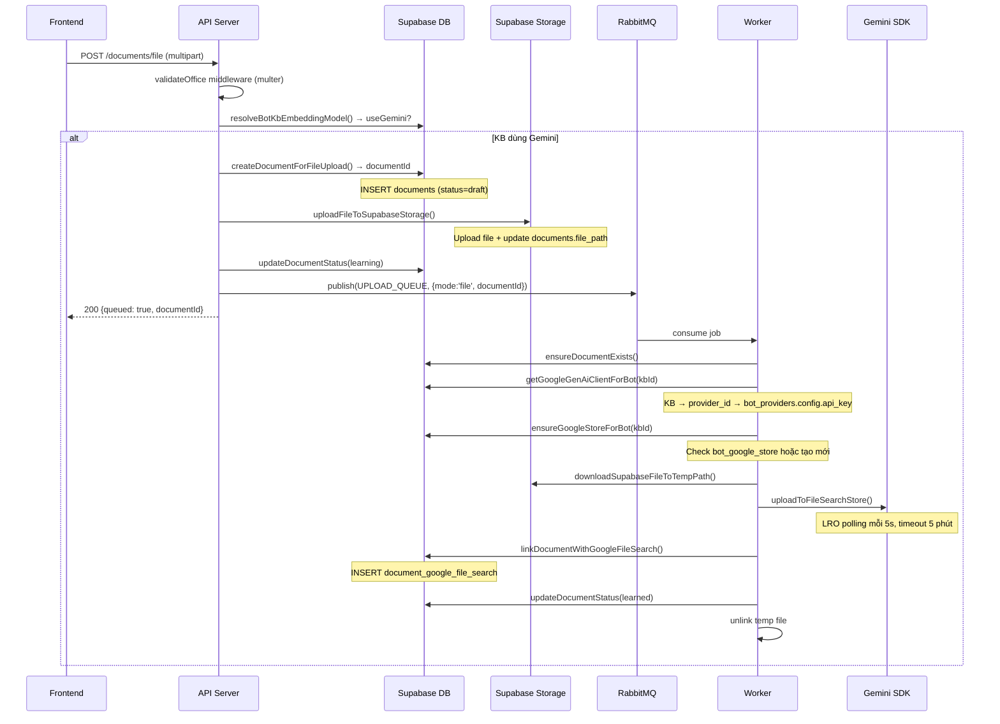
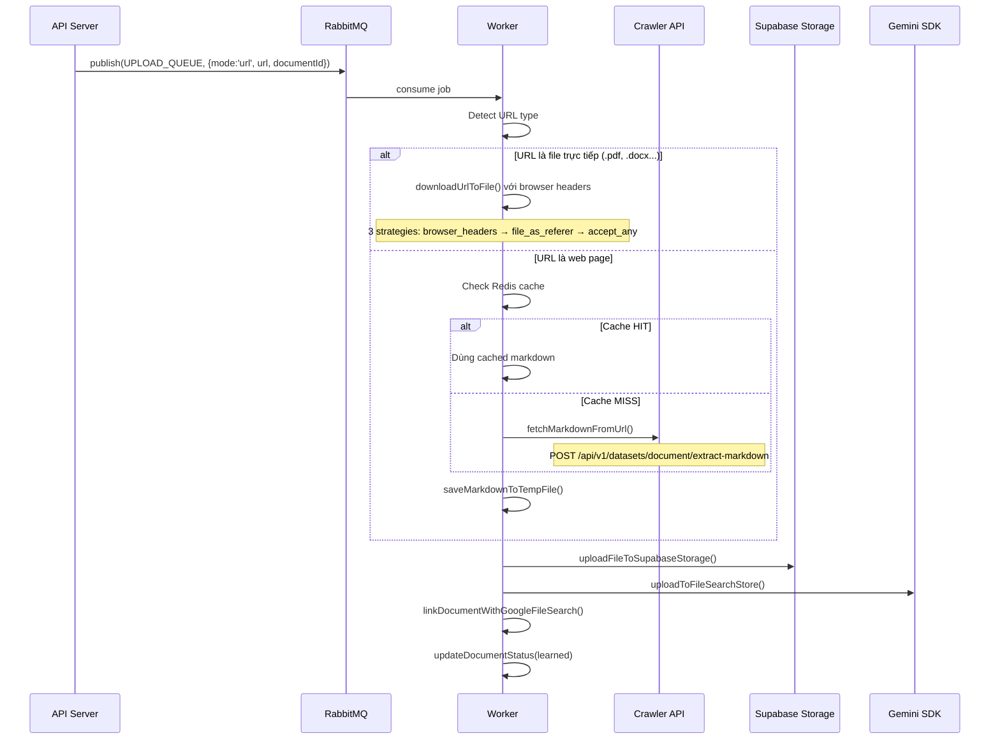
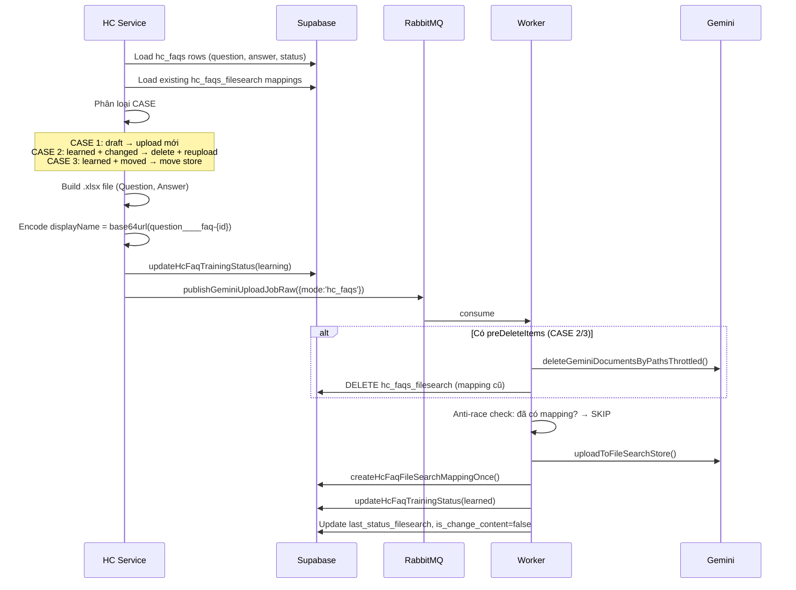
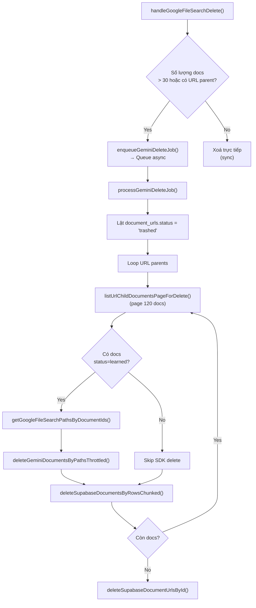

# Google File Search – Deep Dive Documentation

> Tài liệu phân tích chi tiết flow quản lí file, database schema, và kĩ thuật queue  
> trong module **Google File Search** của `chatbot-workflow-engine`.  
> Mục đích: Dùng làm blueprint để áp dụng cho project khác.

---

## 1. Tổng Quan Kiến Trúc

### 1.1 Mục đích

Module này cho phép **upload tài liệu** (file, URL, FAQ, article) lên **Google Gemini File Search Store** để bot AI có thể "học" và trả lời dựa trên nội dung tài liệu. Hệ thống hỗ trợ:

- **4 loại upload**: `file` (PDF/DOCX/...), `url` (web page), `faq` (Excel Q&A), `article` (markdown text)
- **Multi-tenant**: Mỗi tenant có knowledgebase riêng, store riêng
- **Async processing**: Dùng RabbitMQ queue để xử lý nặng ở background
- **Dual-engine**: Tự động chọn Gemini hoặc RAG service dựa trên cấu hình knowledgebase

### 1.2 Tech Stack

| Component | Technology |
|-----------|-----------|
| Runtime | Node.js + TypeScript |
| Database | Supabase (PostgreSQL) |
| File Storage | Supabase Storage |
| Message Queue | RabbitMQ (amqplib) |
| AI SDK | `@google/genai` (Google Gemini) |
| Cache | Redis |
| File Processing | xlsx, axios, fs/promises |

### 1.3 Sơ Đồ Kiến Trúc Tổng Quan



---

## 2. Database Schema (Supabase / PostgreSQL)

### 2.1 Entity Relationship Diagram



### 2.2 Bảng Chi Tiết

#### `knowledgebases` — Quản lí Knowledge Base

| Column | Type | Description |
|--------|------|-------------|
| `id` | UUID (PK) | ID duy nhất |
| `tenant_id` | UUID (FK) | Tenant sở hữu |
| `name` | TEXT | Tên KB |
| `description` | TEXT | Mô tả |
| `model_id` | UUID (FK → bot_provider_models) | Model embedding được chọn (quyết định Gemini vs RAG) |
| `provider_id` | UUID (FK → bot_providers) | Provider chứa API key |
| `created_by` | UUID | User tạo |

> **KEY INSIGHT**: `model_id` quyết định engine. Nếu model name ∈ `ALLOWED_EMBEDDING_MODELS` → dùng Gemini. Ngược lại → fallback RAG.

---

#### `bot_providers` — Provider Configuration (API Key)

| Column | Type | Description |
|--------|------|-------------|
| `id` | UUID (PK) | |
| `tenant_id` | UUID | |
| `name` | TEXT | Tên provider (vd: "Google Gemini") |
| `type` | TEXT | Loại provider |
| `config` | JSONB | **Chứa `api_key`** cho Gemini SDK |

```json
// config example
{
  "api_key": "AIzaSy..."
}
```

---

#### `bot_google_store` — Gemini File Search Store (1:1 với KB)

| Column | Type | Description |
|--------|------|-------------|
| `id` | UUID (PK) | |
| `kb_id` | UUID (FK → knowledgebases, UNIQUE) | 1 KB = 1 Store |
| `store_name` | TEXT | Gemini store name, vd `fileSearchStores/abc123` |

> Mỗi KB chỉ có **đúng 1 store**. Hàm `ensureGoogleStoreForBot()` tự tạo nếu chưa có.

---

#### `documents` — Document chính (file/url/article/faq)

| Column | Type | Description |
|--------|------|-------------|
| `id` | UUID (PK) | Tự generate bằng `randomUUID()` ở Node |
| `tenant_id` | UUID | |
| `kb_id` | UUID (FK) | Thuộc KB nào |
| `type` | ENUM | `'file'` \| `'url'` \| `'faq'` \| `'article'` |
| `name` | TEXT | Tên document / title |
| `status` | ENUM | `'draft'` → `'learning'` → `'learned'` \| `'error'` \| `'archived'` \| `'trashed'` |
| `error_reason` | TEXT | Lí do lỗi (nếu status = error) |
| `source_info` | JSONB | `{ id, name, size, extension }` |
| `file_path` | TEXT | Path trên Supabase Storage (vd `tenant_xxx/file/20251128/doc.pdf`) |
| `content` | TEXT | Nội dung text hoặc URL |
| `document_url_id` | UUID (FK) | Nếu type=url, trỏ về URL parent |
| `created_by` | UUID | |
| `updated_by` | UUID | |

**Status Lifecycle:**
```
draft → learning → learned
                  → error (retry → learning → learned)
learned → trashed (delete flow)
```

---

#### `document_google_file_search` — Mapping Document ↔ Gemini Store

| Column | Type | Description |
|--------|------|-------------|
| `document_id` | UUID (FK → documents, **ON DELETE CASCADE**) | |
| `store_id` | UUID (FK → bot_google_store) | |
| `path` | TEXT | Gemini document path, vd `fileSearchStores/xxx/documents/yyy` |

> **CASCADE**: Khi xoá `documents` row → mapping tự xoá theo.

---

#### `document_urls` — URL Parent (chứa nhiều document con type=url)

| Column | Type | Description |
|--------|------|-------------|
| `id` | UUID (PK) | |
| `name` | TEXT | Tên URL group |
| `content` | TEXT | Start URL |
| `status` | ENUM | `'active'` \| `'trashed'` |

---

#### `hc_faqs` — Help Center FAQ

| Column | Type | Description |
|--------|------|-------------|
| `id` | UUID (PK) | |
| `tenant_id` | UUID | |
| `question` | TEXT | Câu hỏi |
| `answer` | TEXT | Câu trả lời |
| `status` | ENUM | `'public'` \| `'private'` (visibility) |
| `status_training` | ENUM | `'draft'` \| `'learning'` \| `'learned'` \| `'error'` |
| `is_change_content` | BOOLEAN | Đánh dấu content đã thay đổi kể từ lần train cuối |
| `last_status_filesearch` | TEXT | Status (public/private) lúc train lần cuối → dùng để biết file đang nằm ở store nào |

---

#### `hc_faqs_filesearch` — Mapping FAQ ↔ Gemini

| Column | Type | Description |
|--------|------|-------------|
| `id` | UUID (PK) | |
| `faq_id` | UUID (FK → hc_faqs) | |
| `file_path_google` | TEXT | Gemini document path |
| `store_name` | TEXT | Gemini store name |

---

#### `hc_knowledge_base` — Help Center Article

| Column | Type | Description |
|--------|------|-------------|
| `id` | UUID (PK) | |
| `tenant_id` | UUID | |
| `post_title` | TEXT | Tiêu đề bài viết |
| `post_content` | TEXT | Nội dung HTML/Markdown |
| `status` | ENUM | `'public'` \| `'private'` |
| `status_training` | ENUM | Tương tự `hc_faqs` |
| `is_change_content` | BOOLEAN | |
| `last_status_filesearch` | TEXT | |

---

#### `hc_article_filesearch` — Mapping Article ↔ Gemini

| Column | Type | Description |
|--------|------|-------------|
| `id` | UUID (PK) | |
| `article_id` | UUID (FK → hc_knowledge_base) | |
| `file_path_google` | TEXT | Gemini document path |
| `store_name` | TEXT | Gemini store name |

---

### 2.3 Supabase Storage Structure

```
documents/                              ← bucket name (ENV: WORKFLOW_ENGINE_STORAGE_BUCKET_DOC)
  tenant_{tenant_id}/
    file/
      20251128/
        manual_{docId}.pdf
    url/
      20251128/
        example-com_{docId}.md
    article/
      20251128/
        my-article_{docId}.md
    faq/
      20251128/
        faqs_{docId}.xlsx
```

Format: `tenant_{tenant_id}/{type}/{yyyymmdd}/{slug}_{docId}{ext}`

---

## 3. RabbitMQ Queue System

### 3.1 Queue Overview

| Queue | ENV Variable | Default Name | Purpose |
|-------|-------------|--------------|---------|
| Upload | `RABBIT_UPLOAD_GENMINI_QUEUE` | `KB_URL_GOOGLE_FILE_SEARCH_dev` | Upload file lên Gemini Store |
| Delete | `RABBIT_DELETE_GENMINI_QUEUE` | `KB_DELETE_GOOGLE_FILE_SEARCH_dev` | Xoá file khỏi Gemini Store |

### 3.2 RabbitMQ Configuration

```typescript
// config.ts
{
  host: process.env.RABBIT_HOST || 'localhost',
  port: parseInt(process.env.RABBIT_PORT || '5672'),
  user: process.env.RABBIT_USERNAME || 'guest',
  pass: process.env.RABBIT_PASSWORD || 'guest',
  vhost: process.env.RABBIT_VIRTUAL_HOST || '/chatbot',
  reconnectDelay: 5000  // auto-reconnect sau 5s
}
```

### 3.3 Connection Pattern (Singleton)



**Key points:**
- **Singleton pattern**: `RabbitMQConnection.getInstance()` — 1 connection, 1 channel cho toàn app
- **Durable queue**: `{ durable: true }` → queue survive server restart
- **Persistent message**: `{ persistent: true }` → message survive RabbitMQ restart
- **Auto-reconnect**: Khi connection/channel bị đóng → tự reconnect sau `reconnectDelay`

### 3.4 Publisher (Đẩy job vào queue)

```typescript
// publisher.ts — Cực kì đơn giản
class RabbitMQPublisher {
  async publish(queue: string, message: any) {
    const channel = RabbitMQConnection.getInstance().getChannel();
    const payload = Buffer.from(JSON.stringify(message));
    channel.sendToQueue(queue, payload, { persistent: true });
  }
}
```

### 3.5 Consumer (Xử lí job từ queue)

```typescript
// consumer.ts — Với retry logic
class RabbitMQConsumer {
  async consume(queue, callback, onFail?) {
    channel.prefetch(1);  // Chỉ nhận 1 message tại 1 thời điểm
    
    channel.consume(queue, async (msg) => {
      const data = JSON.parse(msg.content.toString());
      const retryCount = msg.properties.headers?.["x-retries"] ?? 0;
      
      try {
        await callback(data);
        channel.ack(msg);          // ✅ Success → ACK
      } catch (err) {
        if (retryCount < 3) {
          // 🔁 Re-publish với retry count + 1
          channel.sendToQueue(queue, msg.content, {
            headers: { "x-retries": retryCount + 1 }
          });
          channel.ack(msg);        // ACK message cũ
        } else {
          // ❌ Max retry → gọi onFail() → ACK để bỏ qua
          await onFail?.(queue, msg.content.toString());
          channel.ack(msg);
        }
      }
    });
  }
}
```

**Retry Strategy:**
```
Attempt 1 → fail → re-publish (x-retries: 1)
Attempt 2 → fail → re-publish (x-retries: 2)  
Attempt 3 → fail → re-publish (x-retries: 3)
Attempt 4 → fail → MAX REACHED → ack + discard
```

> ⚠️ **Không có Dead Letter Queue (DLQ)**. Message lỗi sau 3 lần sẽ bị mất. Nếu cần reliability cao hơn → thêm DLQ.

### 3.6 Job Payload Types

#### Upload Job (`GeminiUploadJob`)
```typescript
{
  documentId: string;       // ID document trong DB
  mode: 'url' | 'file' | 'hc_faqs' | 'hc_article';
  botId?: string;           // Legacy, không dùng nữa
  updatedBy?: string;
  
  // CASE URL
  url?: string;
  
  // CASE FILE/FAQ/ARTICLE
  filePath?: string;        // Path tạm trên disk
  originalName?: string;
  mimeType?: string;
  kbId?: string;
  
  // CASE delete+reupload (tránh race condition)
  preDeleteItems?: HcRawDeleteItem[];
  preDeleteKbId?: string;
}
```

#### Delete Job (`GeminiDeleteJob`)
```typescript
{
  kbId: string;              // Bắt buộc
  botId?: string;            // Legacy
  
  // Xoá theo URL parent
  documentUrlIds?: string[];
  
  // Xoá theo document ID
  documentIds?: string[];
  
  // Help Center delete
  mode?: 'documents' | 'hc_faqs' | 'hc_article';
  items?: HcRawDeleteItem[];
  skipParentStatusReset?: boolean;
}
```

---

## 4. Upload Flow Chi Tiết

### 4.1 Entry Point: `handleGoogleFileSearchUpload()`

Đây là **hàm trung tâm** mà controller gọi. Nó quyết định:
1. KB dùng Gemini hay RAG? → `resolveBotKbEmbeddingModel()`
2. Upload kiểu gì? (file/url)
3. New document hay reupload?



### 4.2 Resolve Gemini vs RAG

```typescript
async function resolveBotKbEmbeddingModel(botId, kbIdFromRequest) {
  // 1. Load knowledgebases.model_id
  // 2. JOIN bot_provider_models → lấy name
  // 3. Nếu name ∈ ALLOWED_EMBEDDING_MODELS → useGemini = true
  
  // ALLOWED_EMBEDDING_MODELS từ ENV:
  // "gemini-3-pro-preview, gemini-2.5-pro, gemini-2.5-flash, gemini-2.5-flash-lite"
}
```

### 4.3 CASE FILE — Upload File Lên Gemini



### 4.4 CASE URL — Upload URL Lên Gemini



### 4.5 CASE HC_FAQS — Help Center FAQ

FAQ được convert thành file `.xlsx` rồi upload lên Gemini:



**3 Cases của HC FAQ:**

| Case | Condition | Action |
|------|-----------|--------|
| **1** | `status_training=draft` | Upload mới vào store theo `status` (public/private) |
| **2** | `learned + is_change_content=true` | Delete cũ + reupload (có thể đổi store nếu status thay đổi) |
| **3** | `learned + is_change_content=false + status≠last_status` | Move store (delete store cũ + upload store mới) |

### 4.6 CASE HC_ARTICLE — Help Center Article

Tương tự FAQ nhưng convert nội dung thành file `.md`:

```typescript
// Build markdown từ article
const md = `# ${title}\n\n${content}\n`;
await fs.writeFile(tmpPath, md, 'utf8');

// Upload với mode = 'hc_article'
await publishGeminiUploadJobRaw({
  documentId: articleId,
  mode: 'hc_article',
  kbId,
  filePath: tmpPath,
  originalName: encodeGeminiName(`${title}____article-${articleId}`),
});
```

### 4.7 Public/Private KB Routing (Help Center)

Mỗi tenant có **2 KB** cho Help Center:

```typescript
// bots table: 1 bot help_center per tenant
{
  kb_ids: [kbPublicId],      // KB cho content public
  kb_id_private: kbPrivateId  // KB cho content private
}

function pickKbByStatus(kbs, status) {
  if (status === 'public') return kbs.kbPublic;
  if (status === 'private') return kbs.kbPrivate;
}
```

→ FAQ/Article `status=public` → upload vào **KB public store**  
→ FAQ/Article `status=private` → upload vào **KB private store**

---

## 5. Delete Flow Chi Tiết

### 5.1 Delete Documents (Gemini)



### 5.2 Throttled Delete (Tránh Rate Limit)

```typescript
// Batch size = 10, pause = 150ms giữa các batch
async function deleteGeminiDocumentsByPathsThrottled(paths, aiClient) {
  for (const batch of chunkArray(paths, 10)) {
    await Promise.all(batch.map(p => 
      aiClient.fileSearchStores.documents.delete({ name: p, config: { force: true } })
    ));
    await sleep(150);  // Tránh 429 Too Many Requests
  }
}
```

### 5.3 Delete HC (FAQ/Article)

```typescript
// processGeminiDeleteJob() mode='hc_faqs' | 'hc_article'
// 1. Delete docs on Gemini SDK by geminiPath
// 2. Delete mapping records (hc_faqs_filesearch hoặc hc_article_filesearch)
// 3. Flip parent status_training = 'draft' (trừ khi skipParentStatusReset=true)
```

---

## 6. Gemini SDK Integration

### 6.1 Client Initialization

```typescript
async function getGoogleGenAiClientForBot(kbId) {
  // knowledgebases → provider_id → bot_providers → config.api_key
  const apiKey = provider.config.api_key;
  return new GoogleGenAI({ apiKey });
}
```

### 6.2 Store Management

```typescript
async function ensureGoogleStoreForBot(kbId, aiClient) {
  // 1. Check bot_google_store WHERE kb_id = kbId
  // 2. Nếu có → return store
  // 3. Nếu chưa có:
  const store = await aiClient.fileSearchStores.create({
    config: { displayName: `kb-store-${kbId}` }
  });
  // 4. INSERT bot_google_store { kb_id, store_name }
}
```

### 6.3 File Upload + LRO Polling

```typescript
async function uploadFileToGeminiFileSearch(storeName, filePath, displayName, aiClient) {
  // 1. Prepare file (ép .md → .txt cho SDK nhận đúng mime)
  const prepared = await prepareGeminiUploadFile(filePath, displayName);
  
  // 2. Upload (trả về Long Running Operation)
  let operation = await aiClient.fileSearchStores.uploadToFileSearchStore({
    file: prepared.uploadPath,
    fileSearchStoreName: storeName,
    config: { displayName: prepared.uploadDisplayName }
  });
  
  // 3. LRO Polling (max 5 phút, mỗi 5s check 1 lần)
  while (!isOperationDone(operation)) {
    if (elapsed > 5 * 60 * 1000) throw new Error('LRO TIMEOUT');
    await sleep(5000);
    operation = await aiClient.operations.get({ operation });
  }
  
  return operation;  // operation.response.documentName = Gemini path
}
```

### 6.4 DisplayName Encoding

Gemini displayName được encode đặc biệt để chứa metadata:

```
Format: {filename}____{link}____{type}
Encode: base64url(UTF-8)

Ví dụ FAQ:  base64url("Câu hỏi ABC____null____faq")
Ví dụ URL:  base64url("example.com/page____https://example.com/page____url")
Ví dụ File: base64url("manual.pdf____null____file")
```

---

## 7. Chat Flow (Sử dụng File Search Store)

### 7.1 Stream Chat với File Search

```typescript
async function sendGeminiFileSearchStream(params) {
  const client = new GoogleGenAI({ apiKey });
  
  // Build history từ OpenMemory (semantic search)
  const history = await buildGeminiChatHistoryByOpenMemory(
    sessionId, limit, tenantId, question
  );
  
  // Config tools: File Search
  const config = {
    tools: [{ fileSearch: { fileSearchStoreNames: storeNames } }],
    systemInstruction: systemPrompt,
    maxOutputTokens: 5000,
  };
  
  // Stream response
  const chat = client.chats.create({ model: modelName, config, history });
  const stream = await chat.sendMessageStream({ message: question });
  
  // Detect "assign_agent" keyword → chuyển sang human agent
  // Extract groundingMetadata → reference sources
}
```

---

## 8. Kĩ Thuật Đáng Chú Ý (Để Áp Dụng)

### 8.1 Anti-Race Condition Pattern

```typescript
// Trước khi upload, check mapping đã tồn tại chưa
const { data: existed } = await sb
  .from('hc_faqs_filesearch')
  .select('id')
  .eq('faq_id', faqId)
  .limit(1);

if (existed?.length > 0) {
  // SKIP upload, set learned luôn
  return;
}
```

### 8.2 Delete + Reupload Atomic Pattern

```typescript
// Thay vì 2 queue riêng (delete rồi upload) → race condition
// → Gộp vào 1 job upload với preDeleteItems
{
  mode: 'hc_faqs',
  kbId: kbIdNew,
  filePath: tmpPath,
  preDeleteItems: [{ mappingId, parentId, storeName, geminiPath }],
  preDeleteKbId: kbIdOld,
}
// Worker xử lý tuần tự: delete cũ → upload mới → link mapping mới
```

### 8.3 Chunked Operations Pattern

```typescript
// Tránh query string quá dài / timeout
function chunkArray<T>(arr: T[], size: number): T[][] {
  const out: T[][] = [];
  for (let i = 0; i < arr.length; i += size) 
    out.push(arr.slice(i, i + size));
  return out;
}

// Dùng everywhere: delete, update status, load docs...
for (const chunk of chunkArray(ids, 30)) {
  await sb.from('documents').delete().in('id', chunk);
}
```

### 8.4 Lazy Client Init Pattern

```typescript
// Chỉ tạo Gemini client khi thật sự cần (có file để xoá)
let aiClient: GoogleGenAI | null = null;
const getAiClientOnce = async () => {
  if (!aiClient) aiClient = await getGoogleGenAiClientForBot(kbId);
  return aiClient;
};
```

### 8.5 URL Download Retry Strategy

```typescript
// 3 strategies khi download URL (tránh hotlink protection / WAF)
const attempts = [
  { name: 'browser_headers', headers: browserHeaders },
  { name: 'file_as_referer', headers: { ...browserHeaders, Referer: rawUrl } },
  { name: 'accept_any', headers: { ...browserHeaders, Accept: '*/*' } },
];
```

### 8.6 File Cleanup Pattern (Always in Finally)

```typescript
try {
  // upload logic...
} catch (err) {
  await updateDocumentStatus(documentId, 'error', err.message);
} finally {
  // LUÔN xoá file tạm dù success hay error
  if (localPath) {
    try { await fs.unlink(localPath); } catch {}
  }
}
```

---

## 9. Environment Variables Quan Trọng

| Variable | Description | Required |
|----------|-------------|----------|
| `WORKFLOW_ENGINE_GOOGLE_EMBEDDING_MODELS` | Danh sách model Gemini (comma separated) | ✅ |
| `WORKFLOW_ENGINE_STORAGE_BUCKET_DOC` | Supabase Storage bucket name | ✅ |
| `RABBIT_HOST` | RabbitMQ host | ✅ |
| `RABBIT_PORT` | RabbitMQ port (default 5672) | |
| `RABBIT_USERNAME` | RabbitMQ user | |
| `RABBIT_PASSWORD` | RabbitMQ password | |
| `RABBIT_VIRTUAL_HOST` | RabbitMQ vhost (default /chatbot) | |
| `RABBIT_UPLOAD_GENMINI_QUEUE` | Upload queue name | |
| `RABBIT_DELETE_GENMINI_QUEUE` | Delete queue name | |
| `WORKFLOW_ENGINE_GEMINI_MD_TEMP_DIR` | Thư mục chứa file tạm | |
| `WORKFLOW_ENGINE_RAG_URL_API` | URL của RAG service | |
| `WORKFLOW_ENGINE_HISTORY_LIMIT` | Số lượng history messages | |
| `WORKFLOW_ENGINE_GEMINI_MAX_OUTPUT_TOKENS` | Max output tokens cho chat | |
| `WORKFLOW_ENGINE_KEYWORD_ASSIGN_AGENT` | Keyword trigger chuyển agent | |

---

## 10. File Map (Source Code Reference)

```
src/
├── server.ts                          ← Bootstrap: init Supabase, Redis, RabbitMQ, consumers
├── services/
│   ├── google/
│   │   ├── google-file-search.service.ts       ← ⭐ CORE (3255 lines)
│   │   │   ├── handleGoogleFileSearchUpload()   - Entry point upload
│   │   │   ├── handleGoogleFileSearchDelete()   - Entry point delete
│   │   │   ├── processGeminiUploadJob()         - Worker: xử lí upload job
│   │   │   ├── processGeminiDeleteJob()         - Worker: xử lí delete job
│   │   │   ├── enqueueGeminiUploadJob()         - Publish upload job
│   │   │   ├── enqueueGeminiDeleteJob()         - Publish delete job
│   │   │   ├── ensureGoogleStoreForBot()        - Tạo/lấy Gemini store
│   │   │   ├── getGoogleGenAiClientForBot()     - Init Gemini SDK client
│   │   │   ├── uploadFileToGeminiFileSearch()   - Upload + LRO polling
│   │   │   └── resolveBotKbEmbeddingModel()     - Quyết định Gemini vs RAG
│   │   ├── google-file-search-consume.service.ts  ← Upload queue consumer
│   │   ├── gemini-delete-consume.service.ts       ← Delete queue consumer
│   │   ├── google-file-search-chat.service.ts     ← Chat stream + history
│   │   └── model.service.ts                       ← List Gemini models
│   ├── hc-documents.service.ts         ← Help Center FAQ/Article → File Search
│   └── rabbitMQ/
│       ├── config.ts                   ← RabbitMQ config
│       ├── connection.ts              ← Singleton connection + auto-reconnect  
│       ├── consumer.ts                ← Consumer base class + retry logic
│       └── publisher.ts              ← Publisher helper
├── controllers/
│   ├── documents.controller.ts        ← HTTP handlers cho document CRUD
│   └── hc-documents.controller.ts     ← HTTP handlers cho Help Center
└── routes/
    └── documents.router.ts            ← Express routes
```
